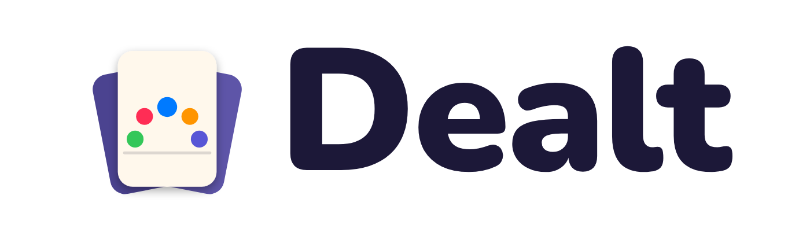
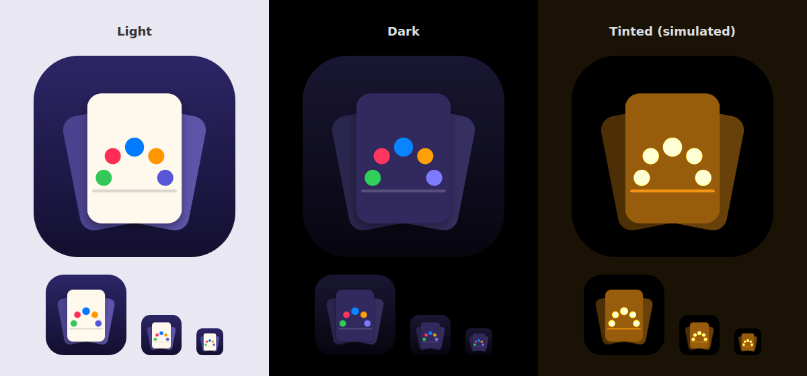

# Dealt brand guide

## The idea

**A life in cards.** One cream card on a night sky, with five dots rising from the horizon and setting again. Each dot is a life stage: Dawn, Bloom, Build, Harvest, Dusk. The cards fanned behind it are the hand you didn't play.

Everything in the brand comes back to that one image: a whole life, small enough to hold.

## Name

| Use | Text |
|---|---|
| App Store name | **Dealt: A Life in Cards** |
| Home screen and in-app | **Dealt** |
| Subtitle | Play one card. Live one life. |
| Tagline (in-app) | Life deals you three cards. Play one. |

Always write it **Dealt**: capital D, no full stop, never all caps. Two other card games on the store are also called "Dealt", so in any listing or store context use the full name "Dealt: A Life in Cards".

## Logo

| Asset | File |
|---|---|
| App icon (light, dark, tinted) | `brand/png/AppIcon*.png`, generated by `brand/make_icons.py` |
| Mark only (no background) | `brand/svg/Mark.svg` |
| Wordmark lockup | `brand/png/Wordmark-light.png` (for light backgrounds), `brand/png/Wordmark-dark.png` (for dark) |
| In-app | `BrandMark(height:)` and `Wordmark(size:)` in `Dealt/Brand.swift` |

- Leave clear space around the mark of at least half the card's width.
- Keep the five dots in stage order, dawn to dusk, left to right. Never recolour them separately.
- Don't add text, outlines or effects to the icon, and don't rotate the front card.
- Edit the icon in `make_icons.py`, then run `brand/render.sh` (see the script header). Never edit the PNGs by hand.

## Colour

**Brand colours**

| Name | Hex | Use |
|---|---|---|
| Night (top) | `#2D2667` | Icon background, share card, store backgrounds |
| Night (bottom) | `#141030` | Bottom of the night gradient |
| Cream | `#FFF8EC` | The card face; text on night |
| Ink | `#1C1838` | Text and lines on cream; the light wordmark |
| Indigo (accent) | `#5856D6` / dark mode `#7D7AFF` | `AccentColor`: system controls, links |

**Stage colours** (iOS system colours, so they match `Stage.palette.accent` in light and dark mode)

| Stage | Ages | Colour |
|---|---|---|
| 🌱 Dawn | 0–11 | Green `#34C759` |
| 🌸 Bloom | 12–23 | Pink `#FF2D55` |
| 🏗️ Build | 24–47 | Blue `#007AFF` |
| 🍂 Harvest | 48–67 | Orange `#FF9500` |
| 🕯️ Dusk | 68+ | Indigo `#5856D6` |

Inside the game, each screen takes its colour from the current life stage. The brand colours frame the game: the icon, the store, the share card, and marketing.

## Type

- **In the app:** SF Pro Rounded (`.fontDesign(.rounded)`). The wordmark is Black weight, sentence case, with slightly tight tracking.
- **In marketing** (store screenshots, web, social): **Nunito**, the closest open-licence match to SF Rounded. Use Black (900) for headlines and Bold (700) for sublines. The font file is in `brand/fonts/` under the SIL Open Font License.
- Never use all caps for the name. Small caps-style labels (`CardHeading`) are fine inside the UI.

## Voice

Dealt sounds warm and wry, and it's brief. It treats life seriously and itself lightly.

| Do | Don't |
|---|---|
| "A sibling appears. Nobody asked you." | "A new family member has been added!" |
| Short sentences, concrete details | Exclamation marks, hype, "epic" |
| Gentle dark humour about death and debt | Cruelty, punching down, real-world tragedy |
| Second person ("you") on cards | Game jargon in the story text (XP, RNG, stats) |
| Card body text under 140 characters | Explaining the joke |

Headlines state the feeling, not the feature: "Your story outlives you", not "Heirloom system".

## ProgrammX

Dealt stands on its own. ProgrammX appears in only two places: as the App Store seller, and as one line at the bottom of the Hall of Fame sheet ("Dealt 1.0 · Made by ProgrammX", from `Brand.credit`). Don't put the ProgrammX logo or teal colour in the app or its store assets.

## App Store kit

- Listing copy: `AppStore/metadata.md`. Check field lengths with `python3 tools/storecheck.py`.
- Screenshots (6.9", 1320×2868): run `brand/store-screenshots.sh <raw captures>` to build `AppStore/screenshots/`. Download the raw captures from the `dealt-xcode26-ios26` CI artifact. They come from an iPhone 17 Pro Max with the status bar set to 9:41.
