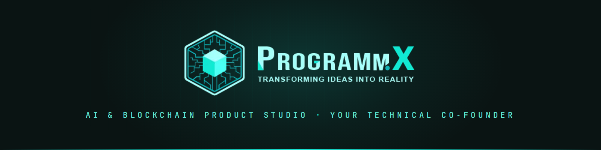

## Your technical co-founder

ProgrammX is an AI & blockchain product studio based in Lahore, working with founders across the US, UK, and Gulf. You bring the idea — we turn it into a real product and keep evolving it.

Most of our clients are non-technical founders and domain experts: people who know their industry deeply and need a team that can carry the technical side end to end. Our first client is still with us, nine years later.

### What we build

**AI solutions** — automations and AI-powered tools that replace manual overhead with intelligent workflows.

**Web & mobile products** — backend, frontend, design, and React Native. Full builds, from idea to shipping MVP.

**Blockchain** — smart contracts, trading bots, and Solana infrastructure. Some of that work is open in this org.

### How we work

A team of 15, working in the open with the people who hire us. Mock-up in days, working demo in weeks. You get updates in plain language — status, trade-offs, what's next — and you'll always know what we built and why.

### Talk to us

Have an idea and no technical team? That's exactly who we work with best.

**[hello@programmx.com](mailto:hello@programmx.com)** · **[programmx.com](https://programmx.com)**

---

ProgrammX · <a href="https://programmx.com">programmx.com</a> · <a href="mailto:hello@programmx.com">hello@programmx.com</a>
